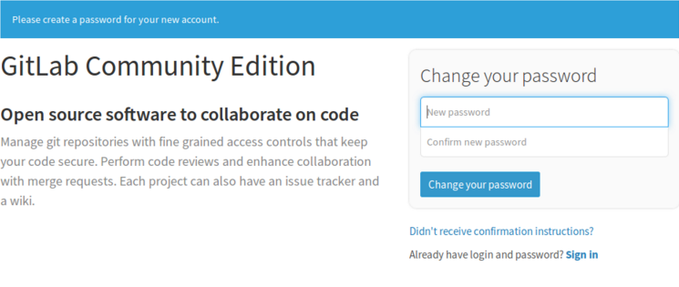
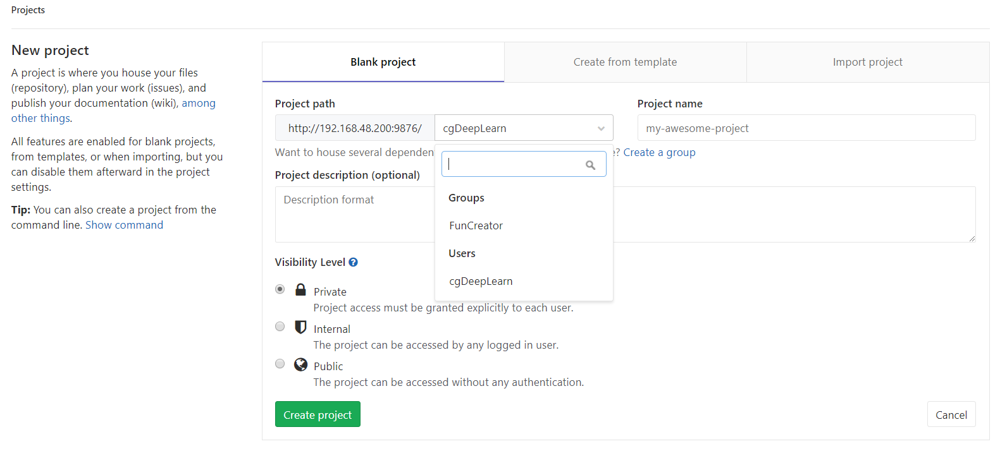

# Ubuntu下搭建Gitlab服务器


## 1.安装依赖包

```cmd
sudo apt-get install curl openssh-server ca-certificates postfix
```

## 2.执行完成后,出现邮件配置，选择`Internet Site`这一项，确定

## 3.添加清华镜像源

- 新人Gitlab的GPG公钥

```
curl https://packages.gitlab.com/gpg.key 2> /dev/null | sudo apt-key add - &>/dev/null
```

- 添加源

`sudo vim /etc/apt/sources.list.d/gitlab-ce.list`,加入如下语句：

```
deb https://mirrors.tuna.tsinghua.edu.cn/gitlab-ce/ubuntu xenial main
```

## 4.安装gitlab-ce:

```
sudo apt-get update
sudo apt-get install gitlab-ce
```

会下载400多MB的，安装完成会占用1GB多的空间，请确保服务器空间充足

## 5.启动各项服务

```
sudo gitlab-ctl reconfigure
```

## 6.检查GitLab是否安装好并且已经正确运行

```
sudo gitlab-ctl status
```

得到如下结果，说明Gitlab运行正常

```log
run: gitaly: (pid 25122) 1215s; run: log: (pid 17658) 2960s
run: gitlab-monitor: (pid 25134) 1214s; run: log: (pid 17872) 2948s
run: gitlab-workhorse: (pid 25139) 1213s; run: log: (pid 17594) 2974s
run: logrotate: (pid 25153) 1211s; run: log: (pid 17626) 2966s
run: nginx: (pid 26851) 857s; run: log: (pid 17610) 2972s
run: node-exporter: (pid 25180) 1210s; run: log: (pid 17842) 2954s
run: postgres-exporter: (pid 25190) 1209s; run: log: (pid 17956) 2934s
run: postgresql: (pid 25201) 1207s; run: log: (pid 17322) 3028s
run: prometheus: (pid 25210) 1204s; run: log: (pid 17914) 2940s
run: redis: (pid 25226) 1201s; run: log: (pid 17256) 3034s
run: redis-exporter: (pid 25309) 1199s; run: log: (pid 17888) 2946s
run: sidekiq: (pid 26311) 1071s; run: log: (pid 17576) 2976s
run: unicorn: (pid 26662) 933s; run: log: (pid 17532) 2982s
```

## 7.配置gitlab external_url访问规则

- 修改gitlab.rb配置文件

```
sudo vim /etc/gitlab/gitlab.rb
```

```diff
- external_url 'http://gitlab.example.com'
+ external_url 'http://192.168.2.200:9876/' 
+ ## 192.168.48.200为服务器地址，请替换为你的
+ ## 9876为自定义的端口，默认为80端口。
```

- 添加防火墙规则

```
## 开放自定义端口访问(上面定义的9876端口)
sudo iptables -A INPUT -p tcp -m tcp --dport 9876 -j ACCEPT
## 如果上面使用的默认端口,就开放80端口
## sudo iptables -A INPUT -p tcp -m tcp --dport 80 -j ACCEPT
```

## 8.启动`sshd`和`postfix`服务

```
sudo service sshd start

sudo service postfix start
```

## 9.浏览页面并设置密码

浏览器输入`http://192.168.2.200:9876`(如果使用的默认端口则为`http://192.168.2.200`),将`192.168.2.200`替换为你的服务器地址.



第一次进入后会出现修改密码的页面

输入密码确认。其默认用户为`root`

然后可以修改用户名密码或者注册新用户等

## 10.创建组、项目



当然也可以从github等仓库导入

## 11.添加ssh-key

这和github等相同

