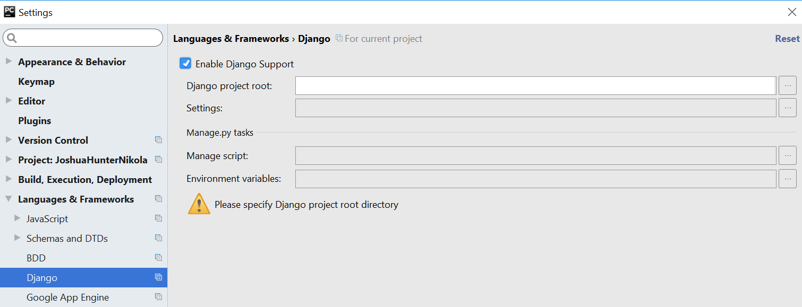
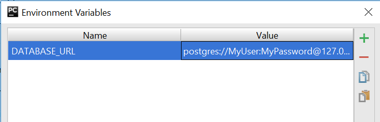

# Cookiecutter

[](https://pyup.io/repos/github/audreyr/cookiecutter-pypackage/)
[](https://travis-ci.org/audreyr/cookiecutter-pypackage)

A command-line utility that creates projects from cookiecutters (project templates), e.g. creating a Python package project from a Python package project template.

* GitHub repo: https://github.com/audreyr/cookiecutter
* Documentation: https://cookiecutter.readthedocs.io
* Free software: BSD license

使用```Cookiecutter```快速建立工程模板,下面主要介绍两种创建[python](#Cookiecutter-PyPackage)包和[Django](#Cookiecutter-Django)包的模板

* [Cookiecutter-Django](#Cookiecutter-Django)
  * [安装配置Cookiecutter-django](#安装配置Cookiecutter-django)
  * [配置使用Django](#配置使用Django)
* [Cookiecutter-PyPackage](#Cookiecutter-PyPackage)
  * [安装配置Cookiecutter-PyPackage](#安装配置Cookiecutter-PyPackage)
  * [示例](#示例)

## Cookiecutter-Django

阅读[英文指南](https://cookiecutter-django.readthedocs.io/en/latest/):

```
https://cookiecutter-django.readthedocs.io/en/latest/
```

### 安装配置Cookiecutter-django

首先, get Cookiecutter.相信我,它棒极了:

```shell
$ pip install "cookiecutter>=1.4.0"
```

然后用`Cookiecutter-django`来生成一个Django项目:

```
cookiecutter https://github.com/audreyr/cookiecutter-pypackage.git
```

你需要在引导下填一些values,例如:

```
Cloning into 'cookiecutter-django'...
remote: Counting objects: 550, done.
remote: Compressing objects: 100% (310/310), done.
remote: Total 550 (delta 283), reused 479 (delta 222)
Receiving objects: 100% (550/550), 127.66 KiB | 58 KiB/s, done.
Resolving deltas: 100% (283/283), done.
project_name [Project Name]: My First Django Project
project_slug [reddit_clone]: my_first_django_project
author_name [Daniel Roy Greenfeld]: cgDeepLearn
email [you@example.com]: cgDeepLearn@gmail.com
description [A short description of the project.]: My first Django Project with Cookiecutter
domain_name [example.com]: myxxxx.com
version [0.1.0]: 0.0.1
timezone [UTC]: Asia/Shanghai
use_whitenoise [y]: n
use_celery [n]: y
use_mailhog [n]: n
use_sentry_for_error_reporting [y]: y
use_opbeat [n]: y
use_pycharm [n]: y
windows [n]: n
use_docker [y]: n
use_heroku [n]: n
use_compressor [n]: y
Select postgresql_version:
1 - 10.3
2 - 10.2
3 - 10.1
4 - 9.6
5 - 9.5
6 - 9.4
7 - 9.3
Choose from 1, 2, 3, 4 [1]: 4
Select js_task_runner:
1 - Gulp
2 - Grunt
3 - None
Choose from 1, 2, 3, 4 [1]: 1
custom_bootstrap_compilation [n]: n
Select open_source_license:
1 - MIT
2 - BSD
3 - GPLv3
4 - Apache Software License 2.0
5 - Not open source
Choose from 1, 2, 3, 4, 5 [1]: 1
keep_local_envs_in_vcs [y]: y
```

根据你的需要来选择一些选项。注: `project_slug`是你的项目名(在路径中体现)

### 配置使用Django

进入项目根目录:

```shell
$ cd  my_first_django_project
$ ls
```

在github创建一个repo,关联你的项目，并首次push:

```shell
$ git init
$ git add .
$ git commit -m "first awesome commit"
$ git remote add origin git@github.com:yourname/yourproject.git
$ git push -u origin master
```

#### 配置Django

选择`Django`安装版本(修改requirements/base.txt):

```
django==1.11.2
# django==2.0.3 ## django 2.0+
```

数据库如果选择了`Postgresql`(Postgresql的安装使用情参考[Postgresql安装配置](https://github.com/cgDeepLearn/LinuxSetups/blob/master/docs/databases/postgresql.md)),需安装`psycopg2`依赖:

```
## requirements/local.txt
psycopg==2.7.4
```

在激活的虚拟环境下安装依赖:

```
$ pip install -r requirements\local.txt
```

#### Pycharm的配置

如果生成项目时选项pycharm填入了y,下面我们来配置一下。

* 打开 `File - Settings` -> `Languages and Frameworks` -> `Django`.



* 勾选上 `Enable Django Support`

我们需要为Django数据库配置Postgresql数据库地址，我们点击`Environment variavles` 的 `...` ,添加`DATABASE_URL`变量(注DATABASE_URL在conf.setting中使用):



* Run the Server

```shell
$ python manage.py migrate
$ python manage.py createsuperuser
$ python manage.py runserver
```

##  Cookiecutter-PyPackage

阅读[英文指南](https://cookiecutter-pypackage.readthedocs.io/en/latest/tutorial.html):

```
https://cookiecutter-pypackage.readthedocs.io/en/latest/tutorial.html
```

### 安装配置Cookiecutter-PyPackage

首先，安装Cookiecutter，相信我，它棒极了:

```python
$ pip install "cookiecutter>=1.4.0"
```

生成一个项目:

```
cookiecutter https://github.com/audreyr/cookiecutter-pypackage.git
```

然后:

* 在github新建一个仓库,git remote关联
* 把仓库添加到 [Travis-CI](http://travis-ci.org/) 账号中
* 将项目依赖添加到虚拟环境中
* 通过PyPI[注册](https://packaging.python.org/distributing/#register-your-project)你的项目
* 运行 Travis CLI 命令: `travis encrypt --add deploy.password` 来加密你的 PyPI 密码，并且当你push一个tag到仓库master分支的时候,能够自动部署到PyPI。
* 通过推送一个tag到master分支来release你的package
* 在[pyup.io](https://pyup.io/)上激活你的仓库

### 示例

下面的地址给出了一个[示例](https://cookiecutter-pypackage.readthedocs.io/en/latest/tutorial.html):

```
https://cookiecutter-pypackage.readthedocs.io/en/latest/tutorial.html
```


